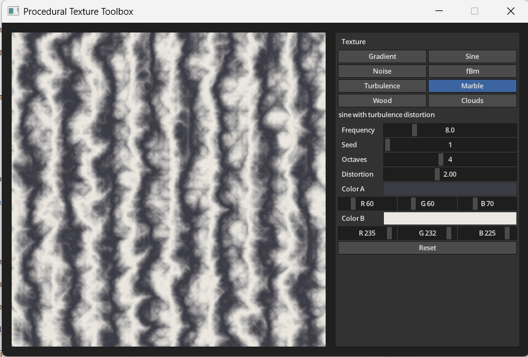
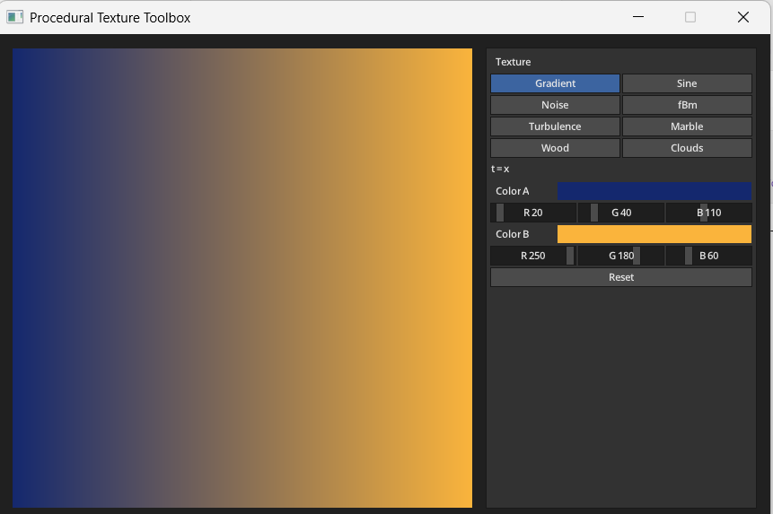
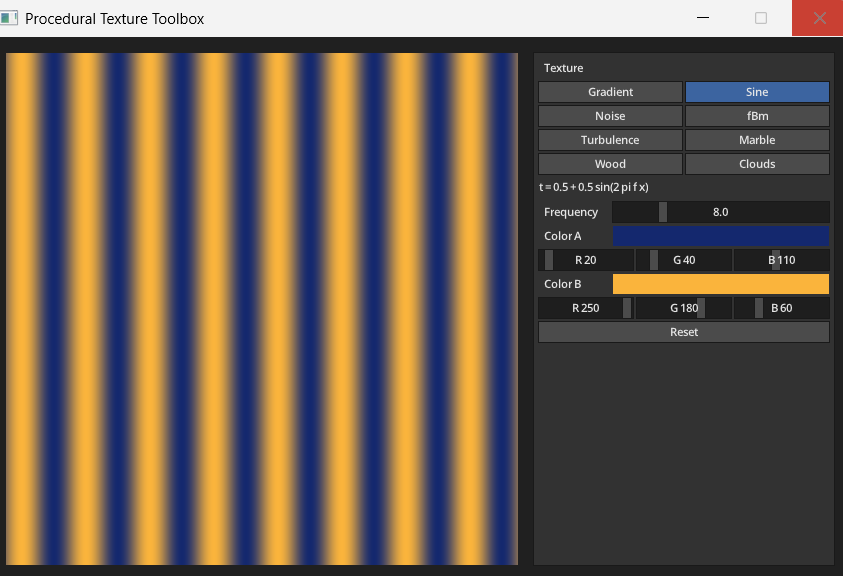
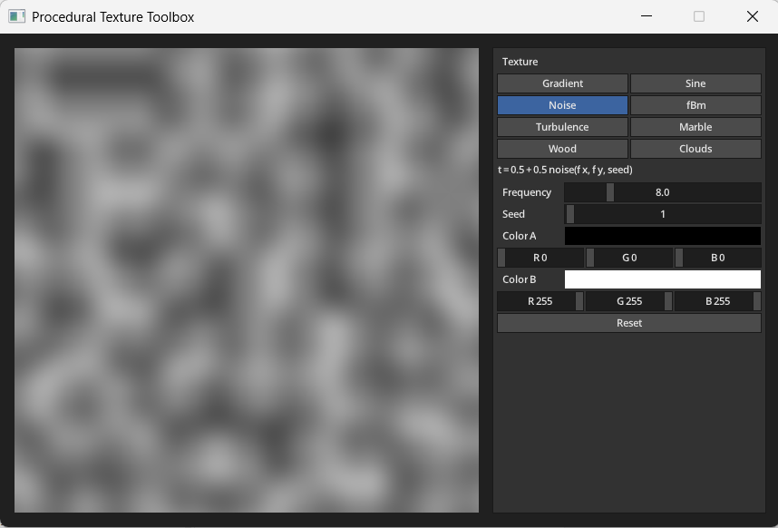
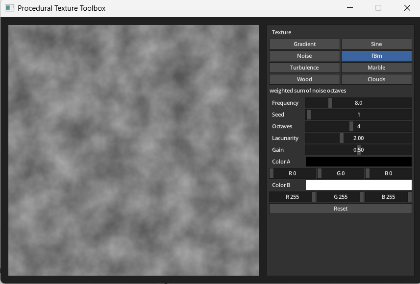
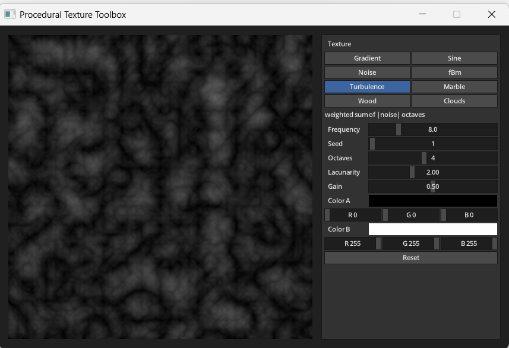
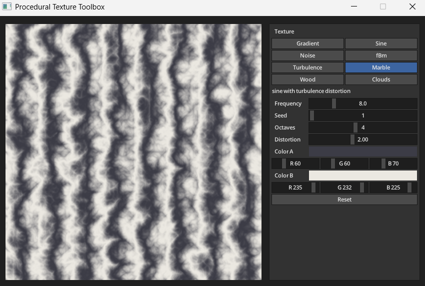
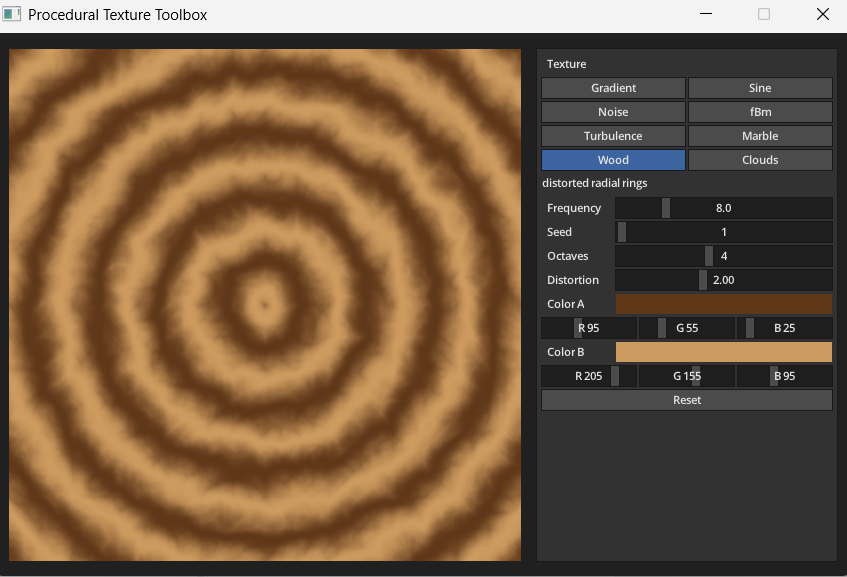
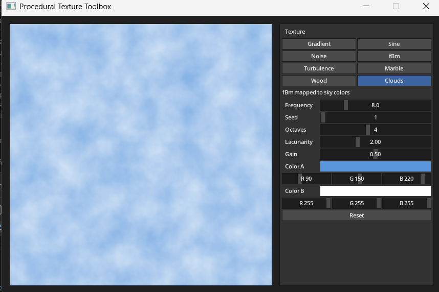

* **Name:** [Farida Dabit]
* **Student ID:** [212693345]
**Course:** Computer Graphics

# Procedural Texture Toolbox

An interactive C++ application that generates procedural textures from mathematical functions, ranging from a simple color gradient to noise-based marble, wood and cloud textures.

## Overview

Procedural Texture Toolbox is a small, standalone C++17 / CMake application that demonstrates increasingly complex procedural texture techniques. It computes a 512 × 512 texture on the CPU, pixel by pixel, and shows it next to a control panel where the texture type and its parameters can be changed interactively.

All textures share the same pipeline:

1. The center of each pixel is mapped to texture coordinates `(u, v)` in `[0, 1]`.
2. The selected texture function computes a value `t` in `[0, 1]`.
3. The pixel color is the linear interpolation `lerp(Color A, Color B, t)`.

The texture is regenerated only when a parameter changes. [MiniFB](https://github.com/emoon/minifb) provides the window and displays the pixel buffer. The control panel is built with [MicroUI](https://github.com/rxi/microui); its draw commands are rasterized into the same pixel buffer by a small software renderer. No GPU or shader code is used.

## Implemented Textures

The textures are ordered so that each one builds on the previous ones. In the formulas, `f` is the frequency and `d` the distortion.

1. **Linear Gradient**: `t = u`. The color is interpolated from Color A at the left edge to Color B at the right edge. Every other texture uses the same interpolation between Color A and Color B.

2. **Sine Pattern**: `t = 0.5 + 0.5 sin(2π f u)`. A periodic pattern with `f` repeating cycles across the texture.

3. **Perlin-style 2D Gradient Noise**: `t = 0.5 + 0.5 noise(f u, f v)`. Deterministic gradient noise on an integer lattice:
   - a small integer hash of the lattice coordinates and the seed selects one of 8 unit gradient directions for each lattice point;
   - for each of the four lattice points around the sample point, the dot product of its gradient with the offset to the sample point is computed;
   - the four values are blended with the smooth interpolation curve `6t⁵ − 15t⁴ + 10t³`;
   - the result is divided by √2, which keeps it within `[-1, 1]`.

   The same seed always produces the same noise.

4. **fBm (fractal Brownian motion)**: several octaves of noise are added. Each octave doubles the frequency and halves the amplitude of the previous one, and the sum is divided by the total amplitude: `fbm = Σ 0.5^i · noise(2^i f u, 2^i f v) / Σ 0.5^i` for `i = 0 … octaves − 1`, and `t = 0.5 + 0.5 fbm`. With one octave, fBm equals the Noise texture.

5. **Turbulence**: the same octave sum as fBm, but with the absolute value of each noise octave: `t = Σ 0.5^i · |noise(2^i f u, 2^i f v)| / Σ 0.5^i`. The absolute value folds the noise at its zero crossings, which creates sharp creases.

6. **Marble**: the sine pattern with its phase distorted by turbulence: `t = 0.5 + 0.5 sin(2π (f u + d · turbulence))`. With distortion 0, Marble reduces to the Sine pattern.

7. **Wood**: radial sine rings around the texture center, with the radius distorted by turbulence: `r = distance((u, v), (0.5, 0.5))` and `t = 0.5 + 0.5 sin(2π f (r + 0.05 d · turbulence))`.

8. **Clouds**: fBm with contrast enhancement. The base value is `t = 0.5 + 0.5 fbm`, then the distance from the midpoint is scaled by 1.35 and clamped to `[0, 1]`. This makes the cloud structure more visible while keeping the same sky-blue to white color mapping.

In the Marble and Wood formulas, `turbulence` is the Turbulence value at `(f u, f v)` with the current seed and number of octaves.

## Design Rationale

I built the textures in stages, starting with simple mathematical patterns and then reusing the same ideas to create more complex results.

- Gradient was the starting point for mapping texture coordinates directly to a color value.
- Sine added a repeating pattern and introduced frequency as an interactive parameter.
- Gradient Noise replaced the regular pattern with smooth deterministic variation controlled by a seed.
- fBm combined several noise octaves to add detail at different scales, while Turbulence used the absolute value of the noise to create sharper structures.
- Marble and Wood use turbulence to distort otherwise regular patterns: sine bands for Marble and radial rings for Wood.
- Clouds use fBm directly because its multi-scale structure already produces a natural irregular pattern. After visual testing, I increased the contrast because the original result looked too flat.

## Controls

| Control | Meaning | Shown for |
|---|---|---|
| Texture | Selects one of the eight textures and loads its default parameters | all |
| Frequency (1–32) | Pattern frequency (sine cycles or rings) and base noise frequency | all except Gradient |
| Seed (0–99) | Selects a different, repeatable noise pattern | Noise, fBm, Turbulence, Marble, Wood, Clouds |
| Octaves (1–8) | Number of noise octaves | fBm, Turbulence, Marble, Wood, Clouds |
| Distortion (0–5) | Strength of the turbulence distortion | Marble, Wood |
| Color A / Color B | Colors for `t = 0` and `t = 1`, set with R, G, B sliders | all |
| Reset | Restores the default parameters of the current texture | all |

Only the controls used by the selected texture are shown, and the panel displays a short formula or description of that texture. The default parameters are frequency 8, seed 1, octaves 4 and distortion 2, with colors chosen per texture.

## Build and Run

Requirements:

- Windows with MSVC (Visual Studio 2022 or the Visual Studio 2022 Build Tools); the project was developed and tested in this environment
- CMake 3.16 or newer
- An internet connection for the first configure

The first configure downloads two dependencies at pinned versions using CMake's `FetchContent`:

- [MiniFB](https://github.com/emoon/minifb) v0.13.0 (MIT license): window and pixel buffer display
- [MicroUI](https://github.com/rxi/microui) v2.02 (MIT license): immediate-mode UI; the font atlas from its demo is used for the UI text

Build and run from the project root (PowerShell):

```powershell
cmake -S . -B build
cmake --build build --config Release
.\build\Release\ProceduralTextureToolbox.exe
```

Run the correctness checks:

```powershell
.\build\Release\ProceduralTextureToolbox.exe --check
```

## Verification

`--check` runs a small set of spot checks at fixed sample points and prints PASS or FAIL for each:

- Gradient: `t = 0` at the left edge and `t = 1` at the right edge; the first and last pixels are close to Color A and Color B
- Sine: known values for `f = 1` and repetition for `f = 4`
- Noise: the same seed gives the same values, a different seed changes them, and the noise is exactly 0 at lattice points
- fBm with one octave matches the base Noise
- Turbulence is non-negative, and with one octave matches `|noise|`
- Marble with distortion 0 matches the Sine pattern
- Wood gives a valid value at the ring center
- Clouds matches the contrast-enhanced fBm mapping, including the 1.35 midpoint scaling and clamping to `[0, 1]`
- The values of every texture stay in `[0, 1]` on a grid of sample points (default parameters)

These checks are not exhaustive. The visual output of all eight textures was checked manually.

## Screenshots



The eight textures with their default parameters:

| | | |
|:-:|:-:|:-:|
| <br>Gradient | <br>Sine | <br>Noise |
| <br>fBm | <br>Turbulence | |
| <br>Marble | <br>Wood | <br>Clouds |


## Development and Refinement Process

Once the main implementation was working, I went through the project again by rebuilding it, running the correctness checks, and comparing the texture outputs visually.

During this review:
- I found that fBm and turbulence could produce NaN when called with zero octaves, so I added a guard for that edge case and corresponding checks.
- The default Clouds texture looked too washed out, so I adjusted its contrast mapping and updated the related check and documentation.
- I also tested a different noise approach for the Wood distortion. It did not improve the visual result, so I reverted that experiment instead of keeping the change.

## AI-Assisted Development

This project was developed with AI assistance, used as a development aid for planning, implementation support and code review. The algorithms, all code changes, the build results and the visual output were reviewed and verified manually.

## Project Structure

```text
ProceduralTextureToolbox/
├── CMakeLists.txt              build configuration; fetches MiniFB and MicroUI
├── README.md
├── screenshots/                images used in this README
└── src/
    ├── main.cpp                window, main loop and control panel
    ├── ProceduralTextures.h    texture types and parameters
    ├── ProceduralTextures.cpp  presets, the eight texture functions and the pixel loop
    ├── Noise.h, Noise.cpp      gradient noise, fBm and turbulence
    ├── Ui.h, Ui.cpp            MicroUI software renderer and mouse input
    ├── ui_atlas.c              access to MicroUI's font atlas (compiled as C)
    └── Checks.cpp              --check correctness checks
```
